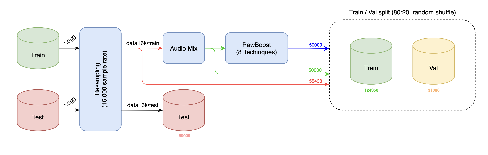
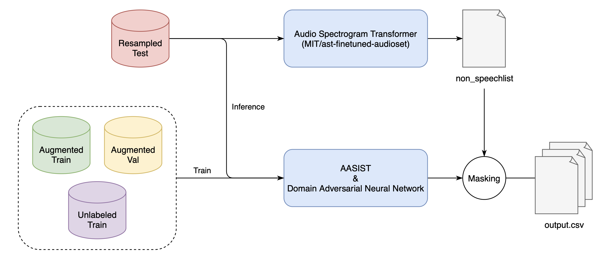
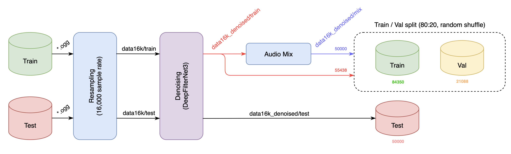
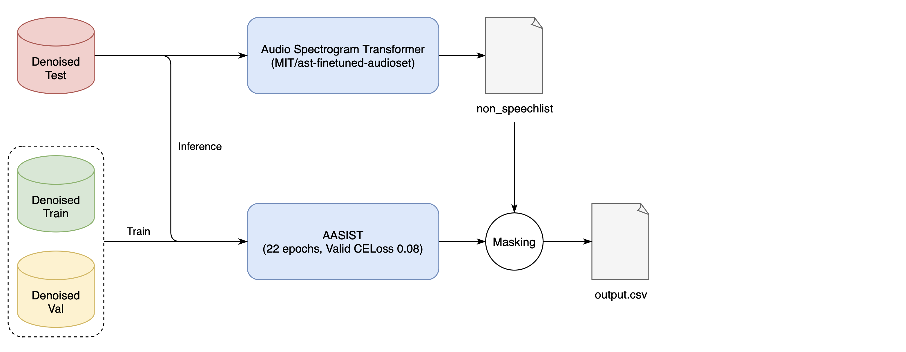

# SW중심대학 경진대회 (AI부문)

주제: 생성 AI의 가짜(Fake) 음성 검출 및 탐지  
기간: 2024.07.01 ~ 2024.07.19  
결과: 219팀 중 10위  
소속: 가천대학교 AI소프트웨어학부

<br />

## MOTA

<div align="center">

| 유종문 | 김의진 | 장희진 | 윤세현 | 최상현 |
| :---: | :---: | :---: | :---: | :---: |
|  |  |  |  | 

</div>

<br />

## 1. 설명

### AASIST with augmented audio (rawboost, DANN)

<div align="center">

**< Audio augmentation process >**



<br>

**< AASIST + DANN Training / Inferencing >**



</div>

### AASIST with denoised audio (deepfilternet)

<div align="center">

**< Audio denoising process >**



<br>

**< AASIST Training / Inferencing >**



</div>


<br />

## 2. 시작

1. 데이터셋 다운로드
```bash
sh /code/prepare_data/download.sh
```

2. Anaconda 가상환경 생성

```bash
conda create -n mota python=3.10.13 -y
conda activate mota
```

3. 데이터 전처리

```bash
sh /code/prepare_data/run.sh
```

4. AASIST + DANN + Rawboost
   
```bash
sh /code/2_aasist_rawboost/run.sh
```

5. AASIST + Denoise

```bash
sh /code/3_aasist_denoise/run.sh
```

6. 앙상블

```bash
sh /code/4_ensemble/run.sh
```

<br>

## 3. 실험 환경

- Ubuntu 22.04.3 LTS
- NVIDIA RTX 4090
- AMD EPYC 7402 24-cores
- 기타 환경 [environment.yaml](/environment.yaml) 참고

<br>

```text
deepfilternet            0.5.6
librosa                  0.10.2.post1
soundfile                0.12.1
pandas                   2.2.2
pydub                    0.25.1
torch                    2.3.1
torchaudio               2.3.1
torchcontrib             0.0.2
tensorboard              2.17.0
tqdm                     4.66.4
```

<br>

## 4. 사전 학습 모델

1. AST (MIT/ast-finetuned-audioset-10-10-0.4593) : masking  
https://huggingface.co/MIT/ast-finetuned-audioset-10-10-0.4593

2. DeepFilterNet : Denoising  
https://github.com/Rikorose/DeepFilterNet

<br>

## 5. 사용된 기법
- 데이터 증강 : Rawboost, Audio mixing (overlapping) <br />
- 모델 : AASIST, DANN(Domain Adversarial Neural Network) <br />
- 데이터 전처리 : DeepFilterNet <br />
- 결과 후처리 : AST(Audio Spectrogram Trnasformer) <br />

<br>

## 6. 성능 평가지표

$$ score = 0.5 \times (1 - \text{mean AUC}) + 0.25 \times \text{mean Brier} + 0.25 \times \text{mean ECE} $$

- $\text{AUC}$ : Area Under the Curve ([설명](https://developers.google.com/machine-learning/crash-course/classification/roc-and-auc?hl=ko))
- $\text{Brier}$ : ([설명](https://en.wikipedia.org/wiki/Brier_score))
- $\text{ECE}$ : Expected Calibration Error ([설명](https://towardsdatascience.com/expected-calibration-error-ece-a-step-by-step-visual-explanation-with-python-code-c3e9aa12937d))

<br>

## 7. 참조

- [1] SW중심대학 디지털 경진대회_SW와 생성AI의 만남 : AI 부문 ([링크](https://dacon.io/competitions/official/236253/overview/description))

- [2] AASIST: Audio Anti-Spoofing using Integrated Spectro-Temporal Graph Attention Networks ([논문](https://arxiv.org/abs/2110.01200), [구현](https://github.com/clovaai/aasist))

- [3] Domain-Adversarial Training of Neural Networks ([논문](https://arxiv.org/abs/1505.07818), [구현](https://github.com/fungtion/DANN))

- [4] Audio Spectrogram Trnasformer ([링크](https://huggingface.co/MIT/ast-finetuned-audioset-10-10-0.4593))

- [5] DeepFilterNet ([구현](https://github.com/Rikorose/DeepFilterNet))

- [6] RawBoost: A Raw Data Boosting and Augmentation Method applied to Automatic Speaker Verification Anti-Spoofing ([논문](https://arxiv.org/abs/2111.04433), [구현](https://github.com/TakHemlata/RawBoost-antispoofing))